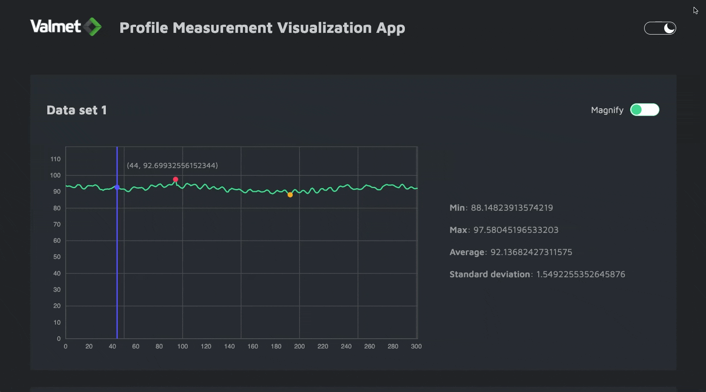

# Profile measurement visualization app

## Project overview

This project aims to visualize and analyze 2 measurement profiles (named: Data set 1 and Data set 2) using line plots, together with their statistics (min, max, average, and standard deviation).
The y-axis represents values of the data points, and the x-axis is its index. 

Give it a look here: https://leannedo-profile-measurement.netlify.app

#### Analysis
As seen in the graph, all the data points distribute in the range of 80 to 100, in which they both reach their peak of around 94 - 97 and sink to the nadir of around 88.

Two graphs, though different in range, bear similar shapes where the first third of the data sets is going towards its peak and then drop to its lowest point and finally regain its balance towards the end.

---
The app offers some other cool features that you can try if reading the statistics seems a bit boring ;)  

#### Dark mode (because why not!)



#### Interactive data visualization and zooming


---

## Technology stacks

- Typescript
- D3
- React
- Webpack
- SASS
- Jest & React Testing Library

## Running the app

To start the app in local environment:

```bash
npm run start
```

Then go to http://localhost:3000 and check it out.

- To create production build (client)

```bash
npm run build
```

- To run all tests

```bash
npm run test
```


## Project structure

```bash
├── config/webpack
├── dist
├── src
│   ├── components
│   ├── views
│   ├── styles
│   ├── utils
│   └── data
├── README.md
├── package.json
└── .gitignore
```
